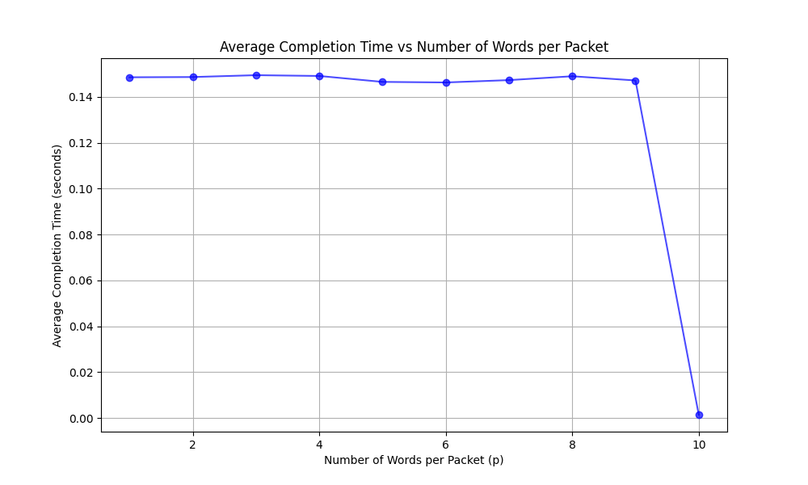

# Word Counting TCP Client-Server

This module implements a TCP-based client-server application to simulate streaming a word file over the network. The client requests words from the server starting at specific offsets and computes their frequency. The server sends words in chunks based on configurable parameters.

---

##  Functionality

- The **server** hosts a memory-mapped comma-separated list of words.
- The **client** requests words from a specified offset using TCP.
- Words are sent in packets of size `p`, and a total of `k` words are sent per request.
- The client stops reading when it encounters the special keyword `EOF`.
- Finally, the client prints the **word frequency in lexicographic order**.

---

##  Communication Protocol

### Client → Server:
- `offset\n` → Request to read `k` words starting at `offset`.

### Server → Client:
- A list of `k` words in `p`-sized packets, or
- `$$\n` if offset exceeds the file length.

---

##  Experiment: Varying Packet Size (`p`)

### Goal:
Study how changing `p` (number of words per packet) affects **average completion time**.

### Setup:
- Fixed number of words per client: `k = 10`
- Values of `p`: 1 through 10
- Each configuration is run for 10 iterations to average results

📈 Plot below shows that increasing `p` reduces the number of packets, improving throughput and lowering completion time.

---

##  Files

- `client.cpp` – Client-side implementation
- `server.cpp` – Server logic using memory-mapped file
- `config.json` – Holds IP, port, `k`, `p`, file name, and client count
- `demo.py` – Automates runs for varying `p` and logs performance
- `plotting.py` – Generates `plot.png`
- `Makefile` – Compilation and automation
- `plot.png` – Completion time vs words per packet
- `words.txt` – Input word file (assumed)

---

##  How to Run

- Compile:
make build
- Run experiment:
make run     # runs demo.py across p = 1 to 10
- Generate plot:
make plot
###  Notes
C++ implementation using POSIX sockets

Works on Linux/macOS (ensure ports are free)

Ensure words.txt is present and formatted as comma-separated words

Part of the COL672: Computer Networks course at IIT Delhi
